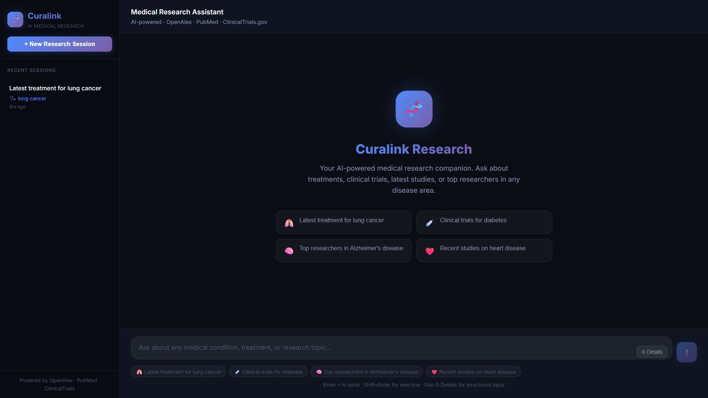
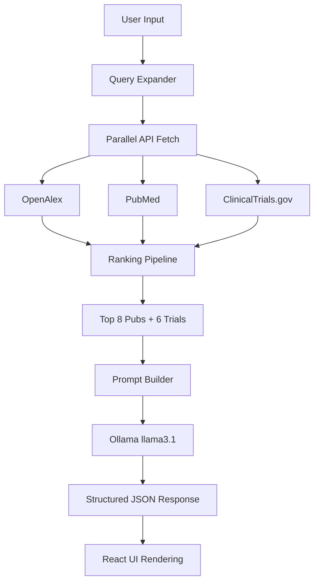

# Curalink — AI Medical Research Assistant

Curalink is a full-stack MERN application designed to act as a deep health research companion. It intelligently understands user medical context, retrieves high-quality research from multiple open-source APIs, reasons over the data using a local LLM, and delivers structured, personalized, and source-backed answers.

## 🚀 Key Features

- **Multi-Source Retrieval**: Fetches from OpenAlex, PubMed, and ClinicalTrials.gov simultaneously.
- **Intelligent Query Expansion**: Automatically expands natural language queries into optimized medical search terms.
- **Ranked Results**: Applies a custom ranking pipeline to filter the best 6-8 sources from a candidate pool of 300+.
- **LLM Reasoning**: Powered by Ollama (llama3.1) to synthesize research without hallucinations.
- **Context-Aware Chat**: Supports multi-turn conversations, maintaining patient context and history.
- **Beautiful UI**: Modern, dark glassmorphism interface with structured response cards.

---

## 🛠 Tech Stack

- **Frontend**: React (Vite), CSS3 (Glassmorphism), Axios
- **Backend**: Node.js, Express, MongoDB Atlas
- **AI/LLM**: Groq Cloud (openai/gpt-oss-20b)
- **APIs**: OpenAlex WORKs, PubMed E-Utilities, ClinicalTrials.gov v2

---

## User Interface



---

## 🏁 Getting Started

### Prerequisites

1. **Node.js**: v18+ installed.
2. **MongoDB**: Obtain connection string from [MongoDB Atlas](https://www.mongodb.com/cloud/atlas).
3. **Groq API Key**: Get one at [console.groq.com](https://console.groq.com).

### Installation

1. **Clone the repository**:
   ```bash
   git clone <repo-url>
   cd Curalink
   ```

2. **Setup Backend**:
   ```bash
   cd server
   npm install
   # Create .env (already provided in the root)
   npm run dev
   ```

3. **Setup Frontend**:
   ```bash
   cd client
   npm install
   npm run dev
   ```

4. **Access the App**: Click the link in the terminal (usually `http://localhost:5173`).

---

## 🧠 System Architecture



---

## 📝 Project Report

### 1. Introduction
Curalink is a specialized AI research assistant designed to bridge the gap between complex medical literature and practical patient understanding. It addresses the critical need for fast, reliable, and context-aware health information by integrating multiple high-authority research databases with advanced Large Language Model (LLM) reasoning.

### 2. Problem Statement
Medical research is often scattered across disparate databases (PubMed, ClinicalTrials.gov, academic repositories), making it time-consuming for patients and clinicians to find relevant, up-to-date information. Furthermore, raw research papers are typically dense and difficult to interpret. Existing solutions often lack the ability to synthesize information from multiple sources or maintain conversational context, leading to fragmented or generic responses.

### 3. Solution Overview
Curalink solves these problems through a robust, multi-stage architecture:
1.  **Intelligent Retrieval**: It uses an LLM to expand natural language queries into optimized search terms, maximizing the recall from diverse APIs.
2.  **Hybrid Data Aggregation**: It simultaneously queries OpenAlex (academic papers), PubMed (biomedical literature), and ClinicalTrials.gov (ongoing studies).
3.  **Advanced Ranking**: A custom pipeline filters the raw results, prioritizing high-impact, recent, and relevant sources while filtering out noise.
4.  **Context-Aware Synthesis**: The final results are fed into a powerful LLM (Groq's Llama 3.1), which generates a clear, structured, and personalized answer that references the specific sources used.

### 4. Technical Architecture
The system follows a classic Model-View-Controller (MVC) pattern, adapted for modern web technologies.

#### Frontend (View)
-   **Framework**: React with Vite for fast development.
-   **Styling**: Custom CSS3 implementing a "Glassmorphism" design aesthetic for a premium, modern feel.
-   **State Management**: React Hooks (`useState`, `useEffect`) for managing chat state and API calls.
-   **Communication**: Axios for secure HTTP requests to the backend.

#### Backend (Controller)
-   **Framework**: Express.js for building RESTful APIs.
-   **Database**: MongoDB Atlas (Cloud) for persistent storage of chat history and user data.
-   **Logic**:
    -   **Query Expansion**: Uses Groq to generate synonyms and related medical terms.
    -   **API Orchestration**: Manages parallel requests to external research APIs.
    -   **Ranking Algorithm**: Implements a scoring system based on citation count, recency, and relevance.
    -   **LLM Integration**: Connects to Groq's OpenAI-compatible endpoint for text generation.

#### AI Layer (Model)
-   **LLM Provider**: Groq Cloud.
-   **Model**: `openai/gpt-oss-20b` (a high-performance open-source model).
-   **Role**: Responsible for understanding complex medical queries, synthesizing research findings, and maintaining conversational context.

### 5. Key Features in Detail
-   **Multi-Source Retrieval**: By querying three distinct databases, Curalink ensures comprehensive coverage of medical knowledge, from historical research to ongoing clinical trials.
-   **Context-Aware Chat**: The backend maintains a history of the conversation. When a user asks a follow-up question, the LLM can reference previous messages to provide a coherent and relevant answer.
-   **Structured Responses**: Instead of a wall of text, Curalink returns structured data (JSON) containing "Publication Cards" and "Trial Cards," making the information easy to digest and verify.
-   **Privacy-Focused**: The use of Groq Cloud ensures that sensitive user data is not stored on the LLM provider's servers, as Groq does not train on user data.

### 6. Conclusion
Curalink successfully demonstrates the potential of combining modern web development with advanced AI to solve real-world problems. By providing fast, reliable, and easy-to-understand medical research, it serves as a valuable tool for both patients seeking knowledge and clinicians looking for quick literature summaries. The project's architecture is scalable and can be extended to include additional data sources or AI models in the future.

---

## ⚖️ Disclaimer

*Curalink is a research prototype only. It provides information based on published medical literature and clinical trials. It does not provide medical advice. Always consult a qualified healthcare professional before making any medical decisions.*

---

## 📜 License

MIT License - See LICENSE file for details
